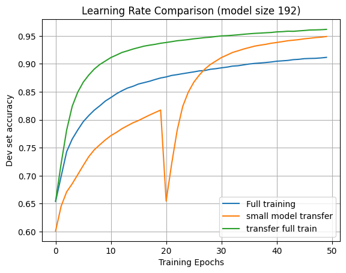
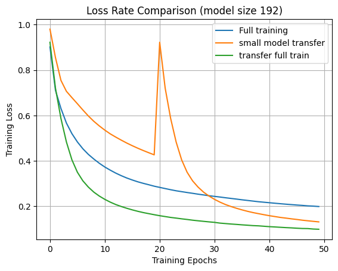
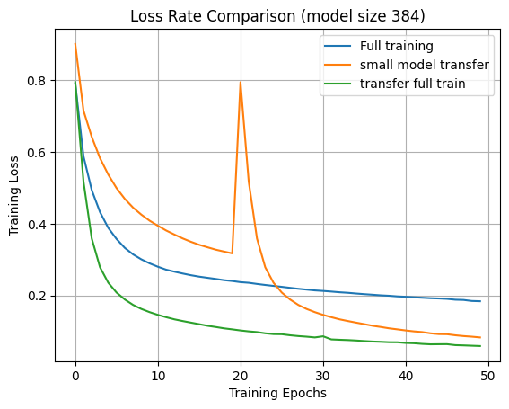

******************** WORK IN PROGRESS *********************

# Transfer learning transformers
## Abstract

The purpose of this is to determine if there is a way to transfer knowledge learned from a smaller transformer model to a larger one. This could allow for more efficient training of LLM's since a large cost of triaining LLM's is the massive ammount of matmuls that need to be done in pretraining. If there exists a way to pretrain a smaller model and then expand it to a larger model, it could save time and money in pretraining.

## Background

In linear algebra there is a way to condense large matrices into smaller ones using Principal Component Analysis (PCA). More formally, this is a linear dimensionality reduction. Since there is a way to go from large to small, is there a way to go from small to large? It will never be able to perfectly recreate what the larger matrix should have been but, would it be possible for it to at least not start from nothing? Is there some way to transfer that information that the smaller matrix has to the larger one?
The underlying idea I had behind this is that since both the large and small models are solving the same problem, there must be some similarities between them. As it turns out they share (approximate) eigenvalues. Since the smaller the matrix is the harder it is to find the optimal solution since it's constrained by how much information it could store. But as you train the smaller matrices more, they do approach the eigenvalues of the larger matrix. What I thought this suggested is that the smaller model is learning a projection of the full solution on a lower dimension. You can think of it as finding the global minimum on a paraboloid. In 3 dimensions you can just use gradient descent but if you project it along a plane (some planes will be better than others) you can still get at least some sense of what and where the minimum is even though you are looking at the problem in only two dimensions. 
The next problem is to find a way to scale this lower dimension solution to a larger matrix.

## Procedure
### Test
To test transfer learning capabilty of transformers a simple task was created to test transformer learning. This task is one that a transformer would excel at in comparison to other LLM models/architectures.

### The Task
The task is given a string of characters, the model must learn to predict, for each position in the string, how many times the character at that position occurred before, maxing out at 2. This 3-class classification problem is an easy task to set up testing data for to compare results. This is becuase the task can be learned with only 1 single-headed transformer layer without using multiple layers or large neural networks on top of the model. The performance of the transformer is directly preportional to the performance of the model. 
This task is also specifically chosen since a transformer would particularly benefit from "looking back" in the input with its' self-attention. 
Below is a sample:

The majority cannot reason; it has no judgment.
00000000001010101122112022021222212222100012220

For each character, the output should be the number of times that character has occurred before.

men love the downfall and disgrace of the righteous
000000011002201010001212121000020222121122111222201

For this example we extended the length of the string to demonstrate the rule. In the training set each string will be 20 characters long as demonstrated below. the vocab is also limited to the english letters and space. Numbers are spelled out as individual digits (10 becomes one zero).

the majority cannot r
men love the downfall
### The dataset
The dataset was taken from text8. 

### Model Architecture

### Steps 
- attempted doubling every col and row
- adding one hot vectors to each matrix to expand it that way
    - this works, knowlede from a 
    - test protocol:
        - Train a transformer for 5 epochs at half the size n/2
        - expand the transformer to full size by simply adding it to the n sized identity
        - train for an additional 5 epochs
        - train a seperate model at full size n for 10 epochs
        - compare average dev set accuracy
        - this test was performed 100 times and averaged     
        - test still needs to be performed more to obtain a statistically valid result
    - results:
        - with smaller models that acheive worse performance, there seems to be little to no improvement, this is with matrix sizes of <48
        - with larger models, the improvement is larger

## Results

| Model size (d_model) | Model size (d_internal) | Dev set accuracy | Dev accuracy (transfer learning) | Transfer Improvement |
|:--------------------:|:-----------------------:|:----------------:|:--------------------------------:|:--------------------:|
| 96 | 48 | 75.83% | 72.44% | -3.39% |
| 192 | 96 | 82.50% | 84.32% | +1.82% |
| 384 | 192 | 88.46% | 93.26% | +4.80% |
| 768 | 384 | 89.80% | 95.04% | +5.24% |

## Analysis

## Conclusion

******************************* workspace ******************************

## Personal Notes

- if generally a transformer learns via gradient descent, and you are training two models on the same problem, if one model is smaller than the other then isn't the smaller model learning a projection of the problem space in a lower dimension?
- if that is the case then the there could be some overlap in the solutions that can be found as you scale the model up, since it'll get a higher resolution image of the terrain of the problem space
- for example, if you take a paraboloid and project it onto a 2d plane, you can get different perspectives of the problem, some useful and some not so useful, but of the useful ones, the low dimensional solution does share some information with the full dimensional solution
- what does it mean for two matrices to have the same singular values?
- Since these matrices all seem to converge to the same singular values there must be something that they are all converging to 
- If they share singular values does that mean that we can construct a new larger matrix based on the singular values of the smaller matrix that will be closer to the solution for the larger matrix?

## Optimal training split
- TODO:
    - compare what kind of transfer learning is best
    - compare transfer training ratio
    - compare ammount of transfer training
    - plot the training rates (dev set accuracy)
        - compare epoch to epoch 
        - compare epoch to epoch for same model size
        - the transfer learning should show a much sharper learning rate
        - also compare training loss? why not 
